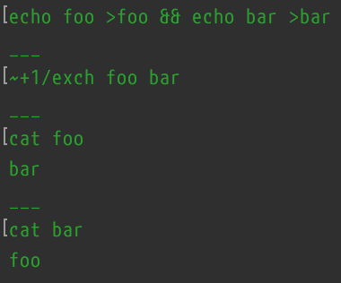

# exch: A command-line tool to swap the contents of two files

macOS has a little-known API in the Toolbox/Carbon/Core Services File Manager named `FSExchangeObjects`. Given two regular files (not symlinks, not directories), `FSExchangeObjects` will swap their contents.

It does this at the file-system level, so it's really fast. On my system, generating two 1 GiB files from /dev/zero on [a RAM disk](/make-ram-disk) takes one second each. Copying that file takes half a second (why that's faster than copying from /dev/zero isn't clear to me). Exchanging their contents with `FSExchangeObjects` is instant.

## Does it work on other file-systems, or only HFS(+/X)?

I haven't tried exhaustively. I do know that it doesn't work on an MS-DOS (FAT16) volume. You get Carbon's ever-helpful “error in user parameter list” error (see below).

## Room for improvement

The error reporting is currently not great. It just dumps the description of the error code from `FSExchangeObjects`, so if you try to use it on one or more directories or symlinks, you get “error in user parameter list”. Likewise if you try to use it on one or more files on an incompatible file-system. I'd welcome a patch to improve the diagnostics there.
